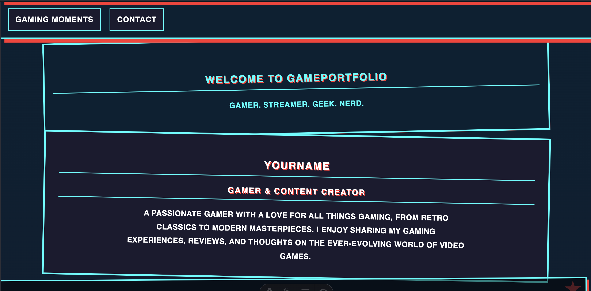

# GamePortfolio – Vibe-Coded Gaming Portfolio Template

[](https://opensource.org/licenses/MIT)
[](https://windsurf.ai/)
[](https://deepmind.google/technologies/gemini/)
[](https://windsurf.ai/)

## Status

**Archived - no longer maintained.**

This repository represents work from an earlier period and is preserved for historical reference only. It is not actively maintained, dependencies may be outdated, and it should not be used as a production reference. 

This project will be removed from public view after related references are retired. 

## 🌐 [Live Demo](https://astro-gamer-portfolio.vercel.app/)

A vibe-coded, modern, and responsive gaming portfolio built with Astro. Showcase your game collection, favorite gaming moments, and connect with fellow gamers. Designed for streamers, content creators, and gaming enthusiasts who want a site that reflects their unique style and passion for games.



---

## What is Vibe-Coding?
This project follows the vibe-coding philosophy—where code isn’t just functional, it’s a reflection of personal style and intuition. Every design and component decision was made based on vibes, creating a portfolio that feels authentically you.

### Development Approach
This project was developed using a vibe-coding workflow powered by AI:
- **Primary Development:** SWE-1
- **Quality Assurance & Debugging:** Gemini 2.5 Pro
- **Development Environment:** Windsurf IDE for seamless AI integration

---

## Tech Stack
- **Framework:** Astro
- **Components:** Astro & React
- **Language:** TypeScript
- **Styling:** CSS Modules (global.css)
- **Content:** Markdown + JSON/JS data files
- **Gallery:** LightGallery.js
- **Validation:** Zod

---

## Prerequisites
* [Node.js](https://nodejs.org/) (which includes npm)

---

## Getting Started

1. **Clone the repository:**
   ```bash
   git clone https://github.com/your-username/game-portfolio.git
   cd game-portfolio
   ```
2. **Install dependencies:**
   ```bash
   npm install
   ```
3. **Start the development server:**
   ```bash
   npm run dev
   ```
   The site will be available at `http://localhost:4321` by default.
4. **Customize your content:**
   - Update site configuration in `src/data/site.ts`
   - Add your games to `src/content/games/`
   - Edit the about page in `src/content/about/index.md`
   - Replace images in `public/images/` and `public/og-img.jpg`

---

## Why This Project?
This project was created to demonstrate a modern, maintainable, and vibey approach to building a personal gaming portfolio. Technical decisions were driven by:
- **Astro:** For speed, simplicity, and flexibility
- **Data-Driven Content:** Games and moments managed via Markdown and JSON/JS data
- **Component-Based Structure:** Modular design for easy customization

---

## Deployment

### Netlify
1. Connect your repository to Netlify
2. Set build command to `npm run build`
3. Set publish directory to `dist`

### Vercel
1. Import your repository to Vercel
2. Build command: `npm run build`
3. Output directory: `dist`

### GitHub Pages
1. Build the project: `npm run build`
2. Deploy the `dist` directory using your preferred static hosting method

---

## Key Features
* **Game Library:** Showcase your game collection with filtering and detailed info
* **Gaming Moments Gallery:** Display favorite screenshots/clips, filter by game/tags
* **Gaming Profiles:** Share your usernames across platforms
* **TypeScript:** Type-safe codebase for maintainability
* **Modern Design:** Clean, responsive, neobrutalist-inspired
* **Blazing Fast:** Built with Astro for optimal performance
* **Fully Responsive:** Works on all device sizes
* **Custom Animations:** Interactive elements with smooth transitions

---

## Project Structure
```
/
├── public/
│   ├── images/               # Static images and assets
│   │   └── gaming-moments/   # Gallery images (fullsize, thumbnails)
│   ├── og-img.jpg            # Social/demo screenshot
│   └── favicon.ico
├── src/
│   ├── components/           # Reusable UI components (gallery, react, etc.)
│   ├── content/              # Content collections (games, about)
│   ├── data/                 # Data files (site config, games, gaming moments)
│   ├── layouts/              # Page layouts
│   ├── pages/                # Astro pages
│   └── styles/               # Global styles (globals.css)
├── package.json
├── astro.config.mjs
└── README.md
```

---

## Customization
1. **Site Info:** Edit `src/data/site.ts` for site title, description, links, SEO, and navigation
2. **Games:** Add Markdown files in `src/content/games/[collection]/` (see below for structure)
3. **About Page:** Edit `src/content/about/index.md`
4. **Gallery Images:** Place images in `public/images/gaming-moments/fullsize/` and thumbnails in `thumbnails/`
5. **Gaming Moments Data:** Edit `src/data/gaming-moments.json` to add new entries
6. **Styling:** Edit `src/styles/globals.css` for visual changes

### Game Markdown Example
```yaml
---
title: "Game Title"
description: "A brief description of the game"
type: "video" # or "tabletop"
platform: "PC, PlayStation, etc."
developer: "Game Developer"
publisher: "Game Publisher"
releaseDate: "YYYY-MM-DD"
genres:
  - "Action"
  - "Adventure"
rating: 9 # 1-10
playtime: 40 # in hours
completed: true
completedDate: "YYYY-MM-DD"
review: "My thoughts on the game"
currentlyPlaying: false
favorite: false
tabletop: false
imageUrl: "/path/to/image.jpg"
---
```

### Game Collections
- `favorite-games/`: All-time favorite video games
- `currently-playing/`: Currently playing video games
- `tabletop-games/`: Tabletop/board games
- `currently-playing-tabletop/`: Currently playing tabletop games

---

## Scripts
| Command               | Action                                 |
| :-------------------- | :------------------------------------- |
| `npm install`         | Install dependencies                   |
| `npm run dev`         | Start local dev server                 |
| `npm run build`       | Build production site to `./dist/`     |
| `npm run preview`     | Preview production build locally       |
| `npm run format`      | Format code with Prettier              |
| `npm run lint`        | Run ESLint                             |
| `npm run astro ...`   | Run Astro CLI commands                 |

---

## Purpose
This repository provides a clean, data-driven template for quickly deploying a personal gaming portfolio. It’s primarily for individual use and public display—fork and adapt as you like!

---

## Contributions
This is a personal/vibe-coded project and is not actively seeking contributions. Feel free to fork and remix for your own use!

---
